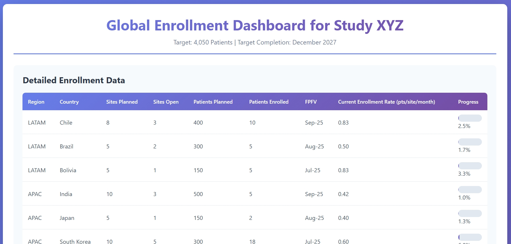
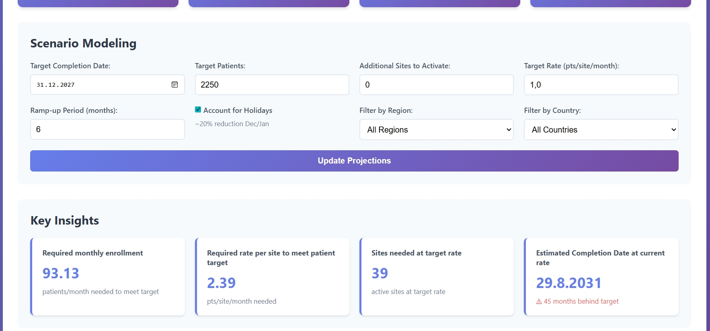
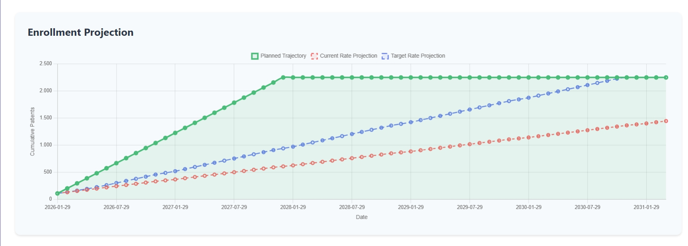
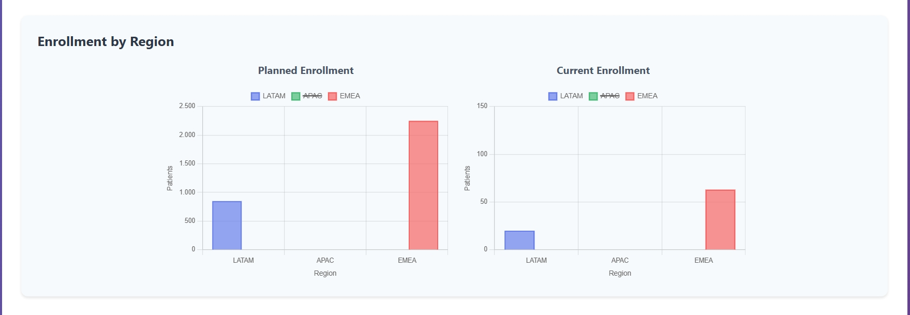

# Enrollment Dashboard demo for study XYZ

An interactive web dashboard for tracking and projecting clinical trial enrollment across global regions (LATAM, APAC, EMEA, North America).

## ✨ Features

- **Sortable data tables** with visual progress bars


- **Real-time enrollment tracking** with progress indicators
- **Scenario modeling** adjust rates, dates, and targets to project outcomes


- **Interactive charts** enrollment projections
- **key data easy to highlight** regional comparisons and filtering



## 🚀 Quick Start

```bash
# Install dependencies
npm install

# Start the server
npm start

# Open browser
http://localhost:3000
```

**Requirements:** Node.js v14+

## 🛠️ Tech Stack

- **Backend:** Node.js, Express
- **Frontend:** Vanilla JavaScript, Chart.js
- **Data:** xlsx library for Excel parsing
